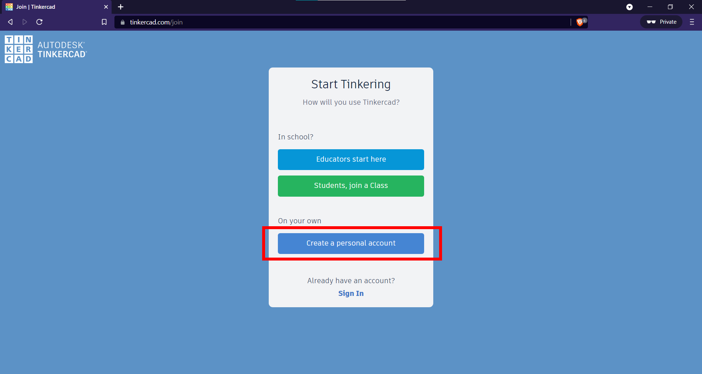
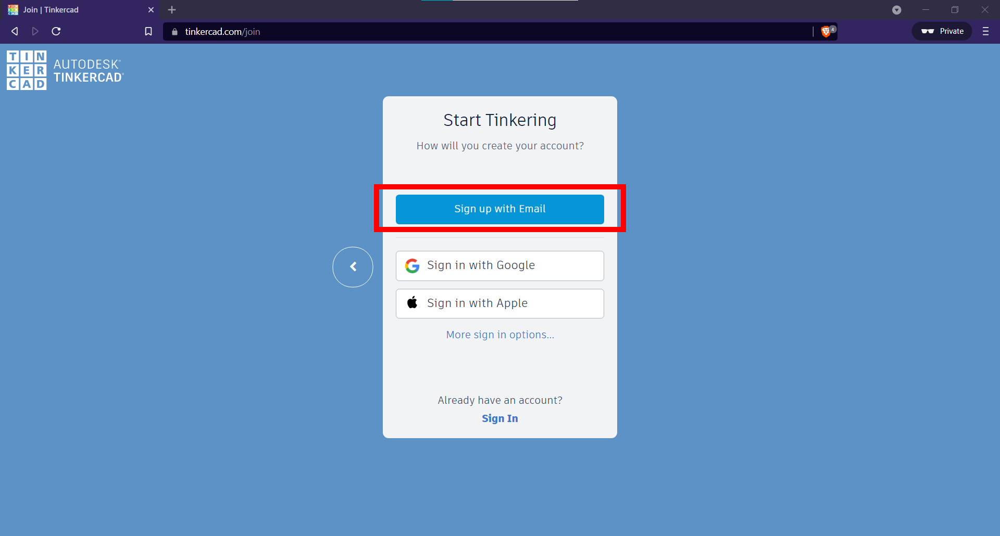
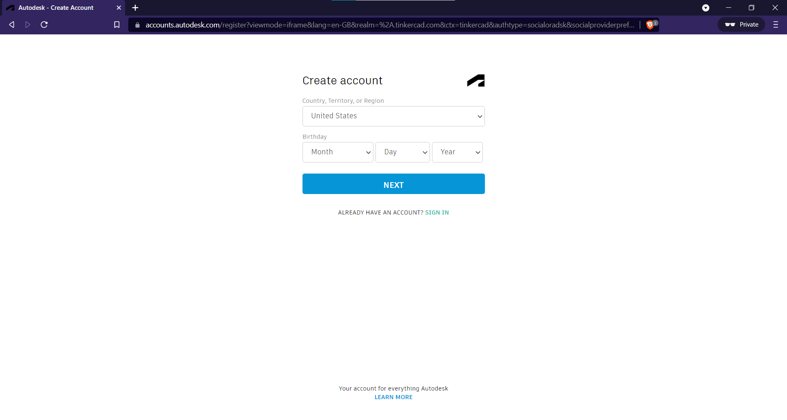
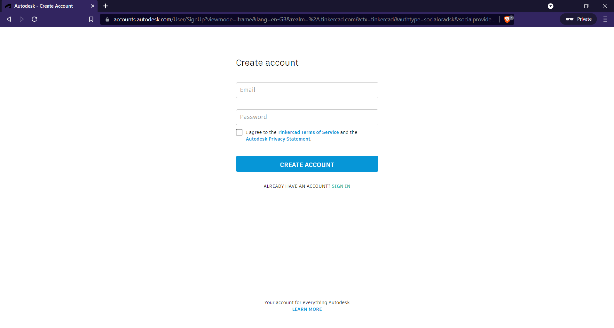
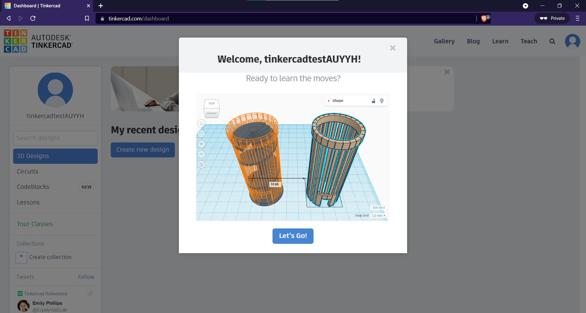
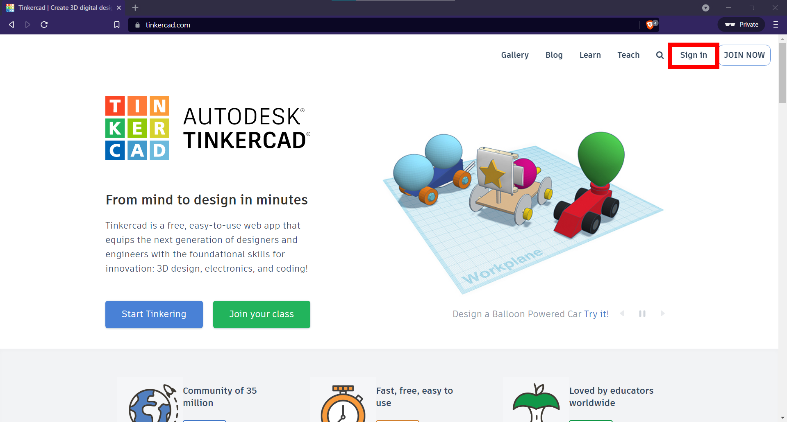
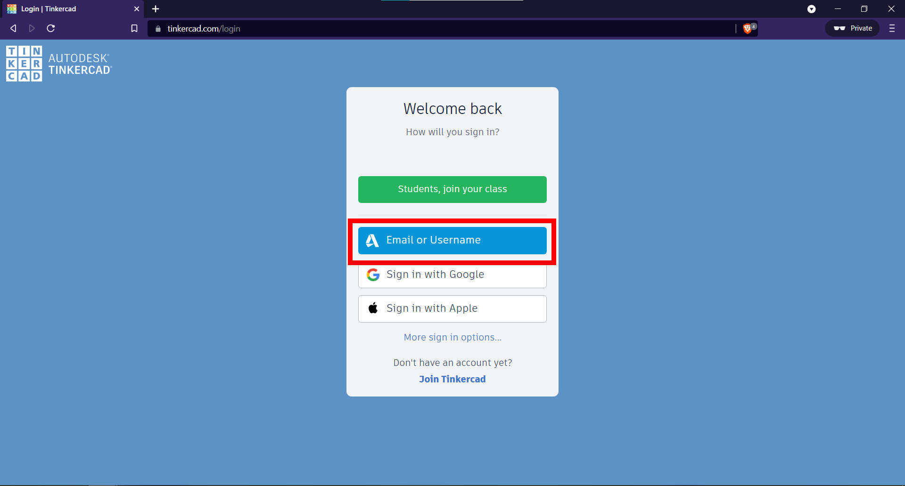
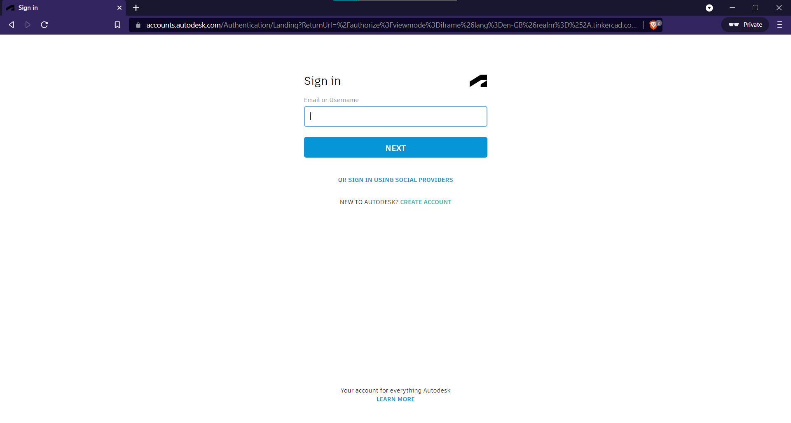
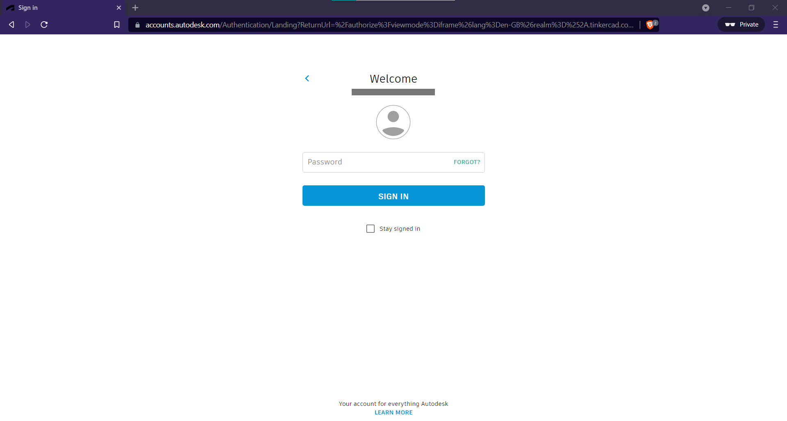

# Tinkercad Guide
* [About](#about)
* [Sign-up for a Tinkercad Account](#signup)
* [Login to Tinkercad](#login)

## About 

We will be using Tinkercad to get some (virtual) hands on experience with Arduino!
## Sign-up for a Tinkercad Account 
1. Head to the [Tinkercad sign-up website](https://www.tinkercad.com/join) and click `Create a personal account`.

2. Select `Sign up with Email`.

3. Fill in the required information.

   > It is recommended to use your SUTD email account, however any email account will work just fine!

4. Enter your email address and desired password. Agree to the `Terms of Service` and `Privacy Statement` and click `CREATE ACCOUNT`.

5. Congratulations! You have successfully created your Tinkercad account!

## Login to Tinkercad 

1. Head to [Tinkercad.com](https://tinkercad.com). If you see the page below, it means you're already signed in. Else, continue to the next step to sign in.

2. To sign in, click on the `Sign in ` button.

3. Select `Email or Username`

4. Enter your email address and password used to sign up for Tinkercad.

5. Congratulations! You've successfully signed in to Tinkercad. You should be able to see your dashboard as shown below.

